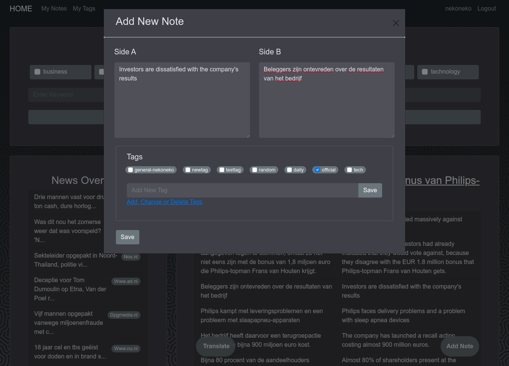
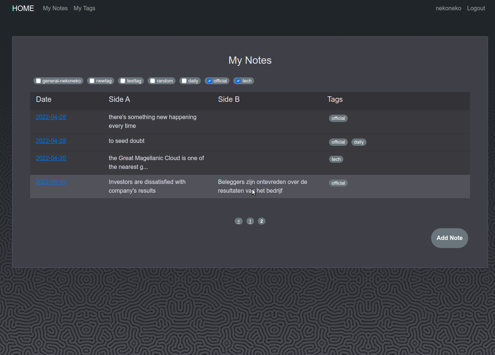
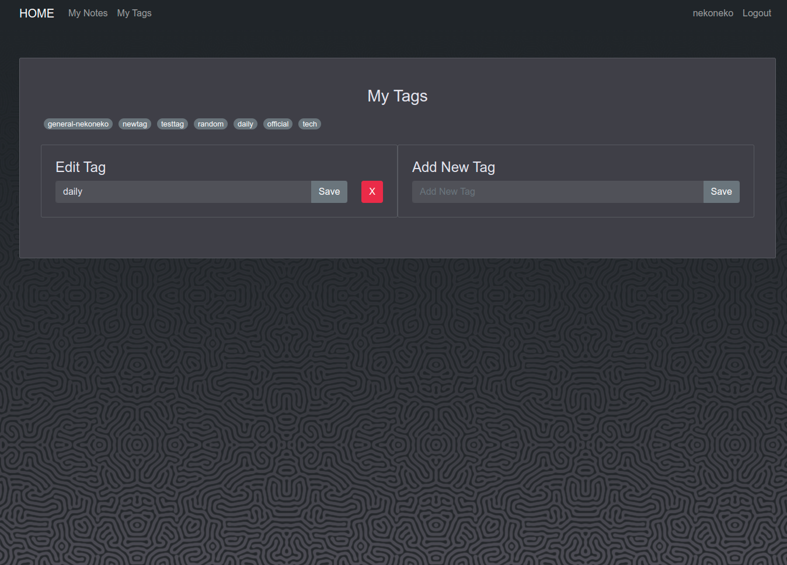
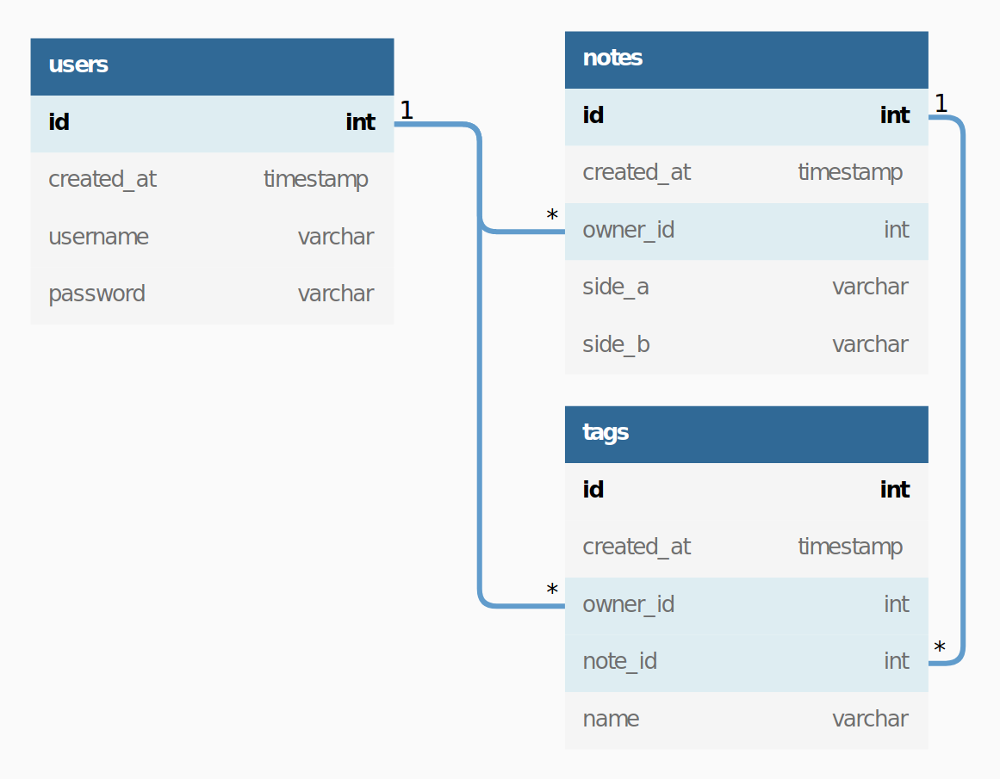

# Dutch News Translator

Simple React app with Django backend to help you learn Dutch by reading Dutch news. It fetches news, optionally translates them to English, and allows you to make two-sided notes to help remember useful words and phrases.

<span style='color: rgb(180,80,80)'>This project is still under construction!!! Currently it can only fetch news from <a href='https://nos.nl/'>nos.nl</a>!!!</span>




<details>
<summary>More Screenshots</summary>


</details>

## 1. Setup
Clone this repo to your machine:
```bash
$ git clone https://github.com/axyorah/nl-news-translator.git
```

After cloning in project root you'll see two directories: `backend` and `frontend`.

### 1.1 Requirements
This projects requires [python3](https://www.python.org/) for backend and [node](https://nodejs.org/en/) v15+ for frontend. 

**Alternatively**, you can run this app from a [docker](https://docs.docker.com/) container. In this can you don't need python or node, but you do need [docker](https://docs.docker.com/get-docker/) and [docker-compose](https://docs.docker.com/compose/install/) installed on your machine.

### 1.2 Environmental Variables
For news-fetching part of the app to work you need to get **API key from [newsapi](https://newsapi.org/)** and save it in `backend/.env` file.

You can get the API key for free by registering with [newsapi](https://newsapi.org/) - just click on a big `Get API Key` button or follow [this direct link](https://newsapi.org/register).

Once you have your key go to `backend` directory, **create file `.env`** and copy your API key in this file like so:
```
NEWSAPI_KEY=<YOUR-NEWSAPI-KEY>
```

### 1.3 Setup Locally (requires Python and Node)
#### 1.3.1 Python Dependencies
While in `backend` directory create and activate python virtual environment, and install the dependencies:

On Mac/Linux
```bash
$ python -m venv venv
$ source ./venv/bin/activate
$ python -m pip install -r requirements.txt
```

On Windows:
```
python -m venv venv
venv\Scripts\activate.bat
python -m pip install -r requirements.txt
```

#### 1.3.2 Node Dependencies
<small style="color: grey;">If you have different node versions on your machine make sure that you're using version 15 or higher.</small>

Go to `frontend` directory and install node dependencies:
```bash
$ npm install 
```

#### 1.3.3 Start
To start backend server make sure that virtual environment is activated. on Linux:
```bash
$ source venv/bin/activate
```

on Windows:
```
venv\Scripts\activate.bat
```

Then **go to `backend`** directory and run:
```bash
$ python manage.py runserver
```

To start React app **go to `frontend`** dir and run:
```bash
$ npm start
```

App will be available at `http://localhost:3000`. API will be available at `http://localhost:8000/api/`.

### 1.4 Setup via Docker 
To build the app go to project root and run:
```bash
$ docker-compose build
```

To run the app services:
```bash
$ docker-compose up
```

This will start both API server and React app.

On Mac/Linux app will be available at `http://localhost:3000` and API will be available at `http://localhost:8000/api/`. On Windows: `http://192.168.99.100:3000` and `http://192.168.99.100:8000/api/`, respectively.

To stop the services:
```bash
$ docker-compose down
```

## 2. What's Under the Hood
### 2.1 Fetching News
News metadata (title, description, url...) is fetched with [newsapi](https://newsapi.org/). This metadata is used to scrap the actual news artical text from its source website. At the moment this app can only scrap news from `nos.nl`.

### 2.2 Translating News
News are translated with [OPUS-MT](https://aclanthology.org/2020.eamt-1.61.pdf) transformer-based [model](https://huggingface.co/Helsinki-NLP/opus-mt-nl-en).

### 2.3 Authentication
This app authenticates users with tokens (JWT) using third-party django plugin [Simple JWT](https://django-rest-framework-simplejwt.readthedocs.io/en/latest/) that works with django REST Framework. 

Token is generated upon providing credentials and is stored in the browser's local storage until expired.

You can still fetch and translate news without authentication. Authentication is only needed if you want to create and store notes and tags.

### 2.4 API
Authenticated users can create double-sided notes and attach multiple tags to those notes for better organization. Here's how relationship between users, notes and tags looks (many-to-many relationship between notes and tags is not shown):



This projects uses django REST Framework to build API for managing users, notes and tags.

Here are the available API endpoints:
```
GET    /api/

GET    /api/news/[?q=<query>&category_list=<cat1,cat2>]
GET    /api/news/selected/?source=<source>&url=<url>
POST   /api/news/translate/

GET    /api/users/           <-- admin only
POST   /api/users/login/
POST   /api/users/new/
GET    /api/users/profile/   <-- authenticated user only

GET    /api/notes/           <-- authenticated user only
POST   /api/notes/           <--...
GET    /api/notes/:id/       <--...
PUT    /api/notes/:id/       <--...
DELETE /api/notes/:id/       <--...

GET    /api/tags/            <-- authenticated user only
POST   /api/tags/            <--...
GET    /api/tags/:id/        <--...
PUT    /api/tags/:id/        <--...
DELETE /api/tags/:id/        <--...
```

### 2.5 Frontend
Frontend uses [React](https://reactjs.org/) with [redux](https://redux.js.org/introduction/getting-started) for state management and [bootstrap](https://react-bootstrap.github.io/) for general prettification.
